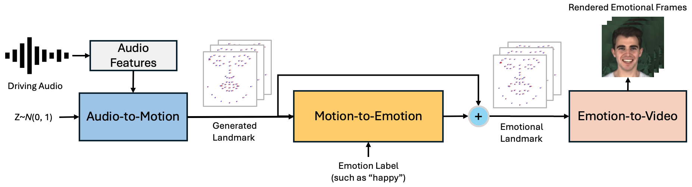

# EmoGene: Audio-Driven Emotional 3D Talking-Head Generatio

[](https://arxiv.org/pdf/2410.17262)| [](https://wnqw.github.io/EmoGene/)  

<p align="center">
    <br>
    
    <br>
</p>

This repository is for EmoGene framework introduced in the following FG'25 paper:

> **EmoGene: Audio-Driven Emotional 3D Talking-Head Generation** \
> [Wenqing Wang](https://wenqing-wang.netlify.app/) and [Yun Fu](https://www1.ece.neu.edu/~yunfu/) \
> Northeastern University 

## Contents
1. [Abstract](#abstract)
2. [Setup](#setup)
3. [Train](#train)
4. [Test](#test)
5. [Citation](#citation)
6. [CustomData](#customdata)
7. [Acknowledgements](#acknowledgements)

## Abstract
Audio-driven talking-head generation is a crucial
and useful technology for virtual human interaction and filmmaking. While recent advances have focused on improving
image fidelity and lip synchronization, generating accurate
emotional expressions remains underexplored. In this paper, we
introduce EmoGene, a novel framework for synthesizing highfidelity, audio-driven video portraits with accurate emotional
expressions. Our approach employs a variational autoencoder
(VAE)-based audio-to-motion module to generate facial landmarks, which are concatenated with emotional embedding in
a motion-to-emotion module to produce emotional landmarks.
These landmarks drive a Neural Radiance Fields (NeRF)based emotion-to-video module to render realistic emotional
talking-head videos. Additionally, we propose a pose sampling
method to generate natural idle-state (non-speaking) videos for
silent audio inputs. Extensive experiments demonstrate that
EmoGene outperforms previous methods in generating highfidelity emotional talking-head videos.

## Setup
- Step 1: Follow the steps in `docs/prepare_env/install_guide.md`, create a new python environment named `emogene`, and download 3DMM files into `deep_3drecib/BFM`.

- Step 2: Download the MEAD dataset from [here](https://wywu.github.io/projects/MEAD/MEAD.html) and follow steps in `docs/process_data` to process it, and place it here `data/binary/videos/MEAD/trainval_dataset.npy`.
```bash
bash scripts/process_data.sh
```

## Train
```bash
bash scripts/train.sh
```
Please refer to details in `docs/train_and_infer`.

## Test
Supported emotion: angry, disgust, contempt, fear, happy, sad, surprise, neutral
```bash
bash scripts/infer.sh
```

## CustomData
Please refer to details in  `docs/process_data` and `docs/train_and_infer`.

## Citation
If our work or code helps you, please consider to cite our paper. Thank you!
```
@inproceedings{wang2025emogene,
  title={Emogene: Audio-driven emotional 3d talking-head generation},
  author={Wang, Wenqing and Fu, Yun},
  booktitle={2025 IEEE 19th International Conference on Automatic Face and Gesture Recognition (FG)},
  pages={1--10},
  year={2025},
  organization={IEEE}
}
```

## Acknowledgments
In this code we refer to the following codebase: [GeneFace++](https://github.com/yerfor/GeneFacePlusPlus.git), [GeneFace](https://github.com/yerfor/GeneFace.git). We gratefully thank the authors for their wonderful works.

